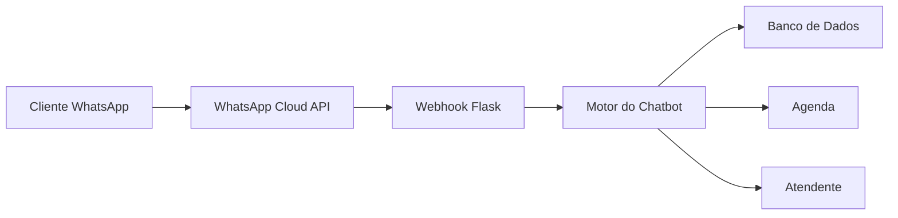
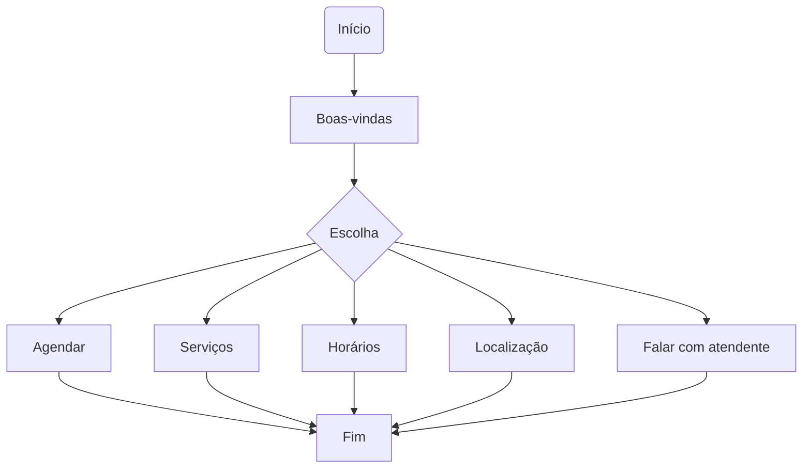

<div align="center">

# 💇‍♀️✨ Salão de Beleza Infantil Tesourinha da Beleza Kids Bot

### Chatbot para atendimento automatizado via WhatsApp de um salão de beleza infantil


---

### 👧 Atendimento inteligente para pais e responsáveis

Agendamento • Informações • Catálogo de serviços • Horários • Localização

</div>

---

# 📋 Funcionalidades

✅ Atendimento automático

✅ Menu interativo

✅ Agendamento

✅ Consulta de horários

✅ Informações sobre serviços

✅ Localização

✅ Encaminhamento para atendente

✅ Mensagens personalizadas

---

# 🏗 Arquitetura



---

# 💬 Fluxo da Conversa



---

# 🛠 Tecnologias

| Tecnologia | Utilização |
|------------|------------|
| Python | Backend |
| Flask | Webhook |
| WhatsApp Cloud API | Comunicação |
| Meta Business | Gerenciamento |
| Ngrok | Desenvolvimento |
| Git | Versionamento |

---

# 🔗 Integração

```
Cliente

↓

WhatsApp

↓

Meta Cloud API

↓

Webhook

↓

Flask

↓

Chatbot

↓

Resposta
```

---

# 🎯 Objetivos

- Automatizar atendimento

- Reduzir tempo de resposta

- Facilitar agendamentos

- Melhorar experiência dos clientes

- Integrar com WhatsApp Business

---

# 📈 Melhorias Futuras

- IA para respostas inteligentes

- Integração com Google Agenda

- Painel administrativo

- Dashboard

- Histórico de atendimentos

- Banco de dados

- Envio de lembretes

- Avaliação do atendimento

---

</div>
